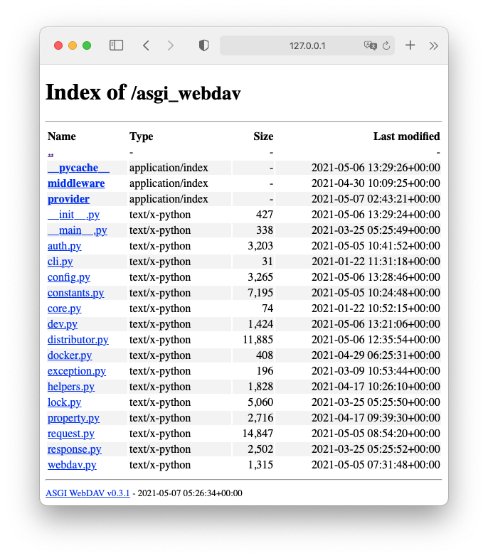

# ASGI WebDAV Server


[](https://codecov.io/gh/rexzhang/asgi-webdav)
[](https://github.com/psf/black)
[](https://lgtm.com/projects/g/rexzhang/asgi-webdav)
[](https://hub.docker.com/r/ray1ex/asgi-webdav)
[](https://github.com/rexzhang/asgi-webdav/releases)

An asynchronous WebDAV server implementation, Support multi-provider, multi-account and permission control.

## Features

- [ASGI](https://asgi.readthedocs.io) standard
- WebDAV standard: [RFC4918](https://www.ietf.org/rfc/rfc4918.txt)
- Support multi-provider: FileProvider, MemoryProvider
- Support multi-account and permission control
- Support optional home directory
- Support store password in raw/hashlib/LDAP(experimental) mode
- Full asyncio file IO
- Passed all [litmus(0.13)](http://www.webdav.org/neon/litmus) test, except 2 warning
- Browse the file directory in the browser
- Support HTTP Basic/Digest authentication
- Support response in Gzip/Brotli
- Compatible with macOS finder and Window10 Explorer

## Quickstart
[中文手册](https://rexzhang.github.io/asgi-webdav/zh/)

```shell
docker pull ray1ex/asgi-webdav
docker run --restart always -p 0.0.0.0:8000:8000 \
  -v /your/data:/data \
  -e UID=1000 -e GID=1000 \
  --name asgi-webdav ray1ex/asgi-webdav
```

## Default Account

|            | value      | description                     |
|------------|------------|---------------------------------|
| username   | `username` | -                               |
| password   | `password` | -                               |
| permission | `["+"]`    | Allow access to all directories |

## View in Browser



## Documentation

[Github Page](https://rexzhang.github.io/asgi-webdav/)

## TODO

- Digest auth support
- SQL database provider
- PROPFIND support DAVDepth.infinity
- Test big(1GB+) file in MemoryProvider
- disable @eaDir at anywhere?
- display server info in page `/_/admin` or `/_/`
- default user have not admin privileges
- OpenLDAP
- Fail2ban(docker)
- NFSProvider

## Related Projects
- https://github.com/bootrino/reactoxide

## LDAP 方案

是否有方案在 ldap 中保存权限信息？？

### 账号信息全部存放在 ldap server

- 劣势
  - 需要在配置文件中存放一个高级 ldap 账号，这样才能列出所有的可用账号
    - 如果不在启动时将全部可用账号清单装入内存，那么每一个未知账号登录时都会导致一个 ldap 请求，并有较大延迟
      - DDoS 攻击防御能力弱
  - 可能所有 ldap 账号的权限都只能是一样的
- 优势
  - 账号数量可以是无限制的，添加账号不用重启服务
  - 账号维护轻松

### 账号信息部分存放在配置文件

- 劣势
  - 账号数量的固定的，添加账号需要重启服务
  - 需要为每一个 ldap 账号在配置文件中增加一条记录
    - "password": "ldap:"
- 优势
  - 可以为每一账号设置不同的 ldap 参数
  - 可以为每个账号设置不通的权限策略
  - 权限可以全部在配置文件中集中管理
