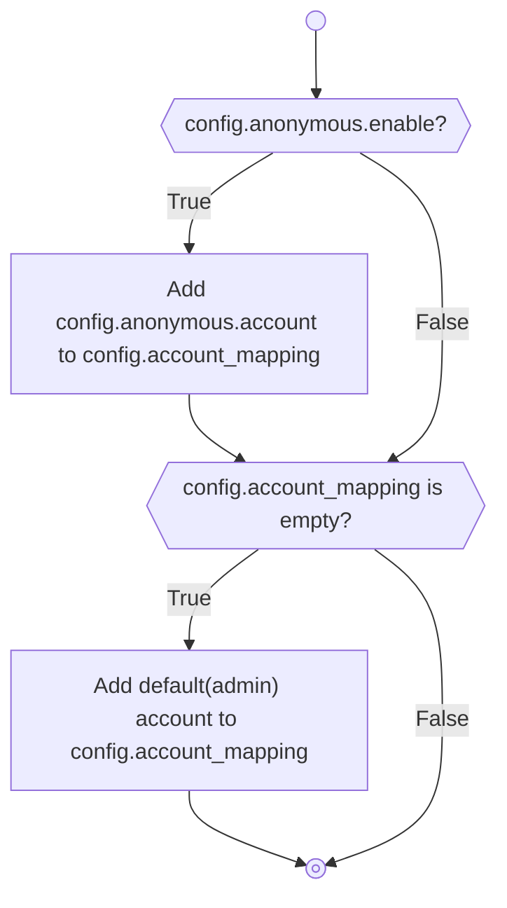
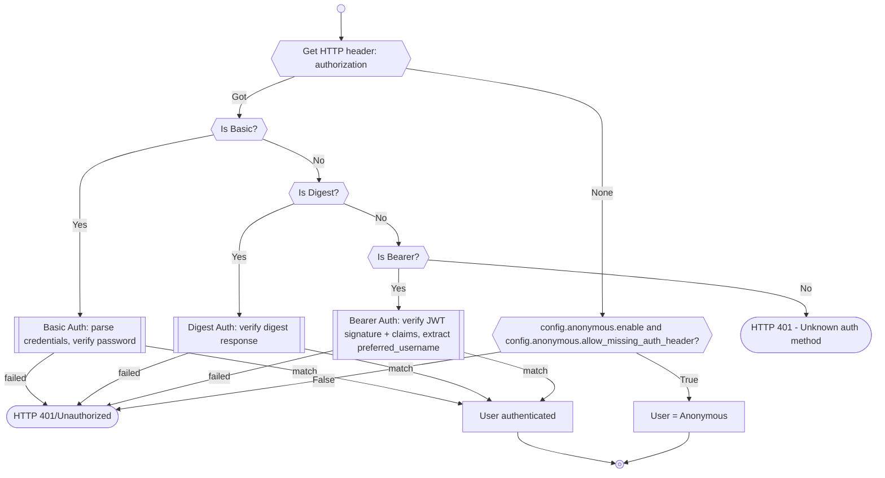

# Authentication

## Account Preprocessing

- If anonymous account are enabled, they will be automatically added to the list of accounts
- If can not found any account, the system will automatically add a default(admin) account.

## Match/Check Account

The server supports three authentication methods, checked in this order:

1. **HTTP Basic Auth** — `Authorization: Basic <base64(user:password)>`
2. **HTTP Digest Auth** — `Authorization: Digest <digest-data>`
3. **HTTP Bearer Auth (OIDC)** — `Authorization: Bearer <access_token>`
4. **Anonymous** — no `Authorization` header, falls back to the anonymous user (if enabled)

### Bearer Auth (OIDC)

When a client sends `Authorization: Bearer <access_token>`:

1. The JWT is verified locally against the IdP's JWKS public keys (fetched at startup).
2. Required claims are checked: `iss`, `aud`, `azp`, `typ` ("Bearer"), `scope`, `exp`.
3. The `preferred_username` claim is extracted and looked up in `account_mapping`.
4. If found, that user's permissions are used. If not found, the `*oidc` template permissions are inherited.
5. If the token is invalid or the subject is not configured, HTTP 401 is returned.

See [Protect your password](protect-your-password-in-the-config.en.md#oidc-openid-connect-bearer-auth) for configuration details.

## Anonymous Account

More detail, please see howto.
