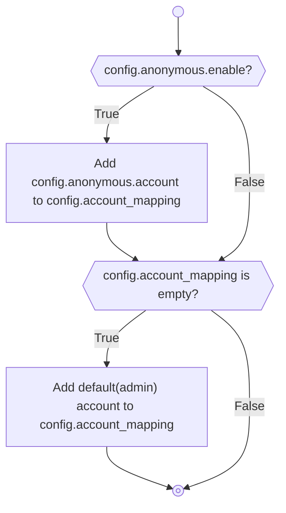

# Authentication

## Account Preprocessing

- If anonymous account are enabled, they will be automatically added to the list of accounts
- If can not found any account, the system will automatically add a default(admin) account.



## Match/Check Account

The server supports three authentication methods, checked in this order:

1. **HTTP Basic Auth** — `Authorization: Basic <base64(user:password)>`
2. **HTTP Digest Auth** — `Authorization: Digest <digest-data>`
3. **HTTP Bearer Auth (OIDC)** — `Authorization: Bearer <access_token>`
4. **Anonymous** — no `Authorization` header, falls back to the anonymous user (if enabled)


### Bearer Auth (OIDC)

When a client sends `Authorization: Bearer <access_token>`:

1. The JWT is verified locally against the IdP's JWKS public keys (fetched at startup).
2. Required claims are checked: `iss`, `aud`, `azp`, `typ` ("Bearer"), `scope`, `exp`.
3. The `preferred_username` claim is extracted and looked up in `account_mapping`.
4. If found, that user's permissions are used. If not found, the `*oidc` template permissions are inherited.
5. If the token is invalid or the subject is not configured, HTTP 401 is returned.

See [Protect your password](protect-your-password-in-the-config.en.md#oidc-openid-connect-bearer-auth) for configuration details.

#### OpenID Connect Access Token Requirements

To authenticate using OpenID Connect, the Identity Provider (IdP) **must issue a JWT access token** containing the following claims.

The server validates these claims to ensure the token was issued by the expected provider, intended for this application, and grants the required permissions.

| Claim | Required | Description |
|--------|----------|-------------|
| `iss` | Yes | The issuer of the token. Must match the configured OIDC issuer URL. |
| `aud` | Yes | The intended audience of the token. Must match the configured audience for this application. |
| `azp` | Yes | The authorized party (OAuth client ID). Must match the configured client ID. |
| `typ` | Yes* | Must be `Bearer`. Some providers omit this claim because all OAuth access tokens are bearer tokens by definition. |
| `scope` | Yes | Space-separated list of granted scopes. Must include the configured required scope. |
| `preferred_username` | Yes | Username associated with the authenticated user. Used as the application identity. |
| `groups` | Optional | List of group memberships. Can be mapped to application permissions using `group_prefix`. |
| `exp` | Yes | Expiration timestamp (Unix epoch). Expired tokens are rejected. |

##### Example

```json
{
  "iss": "https://idp.example.com/realms/main",
  "aud": "webdav",
  "azp": "webdav-client",
  "typ": "Bearer",
  "scope": "openid webdav",
  "preferred_username": "alice",
  "groups": [
    "webdav:read",
    "webdav:write"
  ],
  "exp": 1750000000
}
```

##### Claim validation

During authentication the server performs the following checks:

| Claim | Validation |
|--------|------------|
| `iss` | Must equal the configured issuer. |
| `aud` | Must contain the configured audience. |
| `azp` | Must equal the configured client ID. |
| `typ` | Must be `Bearer` (if present). |
| `scope` | Must contain the required scope. |
| `preferred_username` | Used as the authenticated username. |
| `groups` | Optionally mapped to application permissions. |
| `exp` | Must be in the future. |

##### Compatibility

Most OpenID Connect providers (including Keycloak, Authentik, Authelia, Dex, Zitadel and others) can be configured to produce tokens compatible with these requirements.

The exact set of claims included in the access token depends on the provider configuration and the scopes requested by the client. In particular, claims such as `preferred_username` and `groups` typically require the corresponding OIDC scopes (for example `profile` and `groups`) to be granted.

## Anonymous Account

More detail, please see howto.
